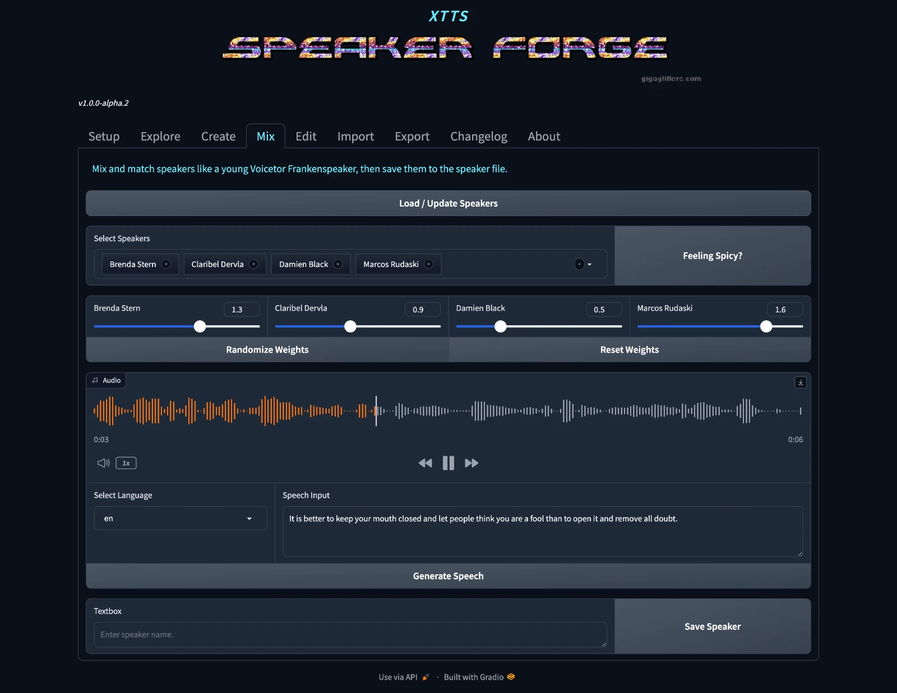
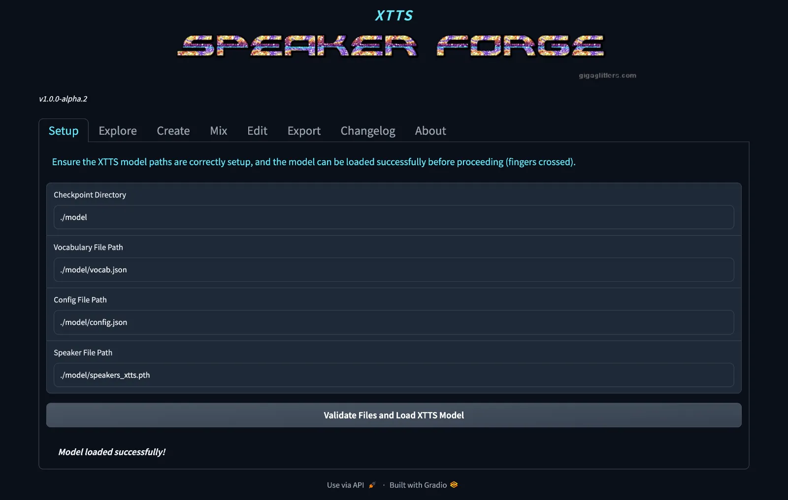
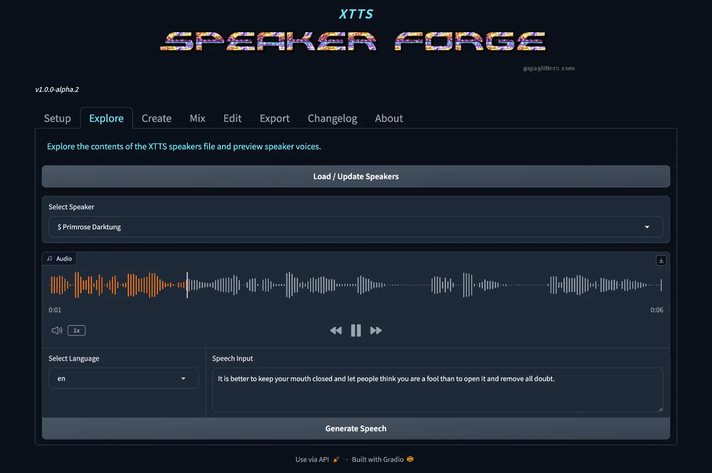
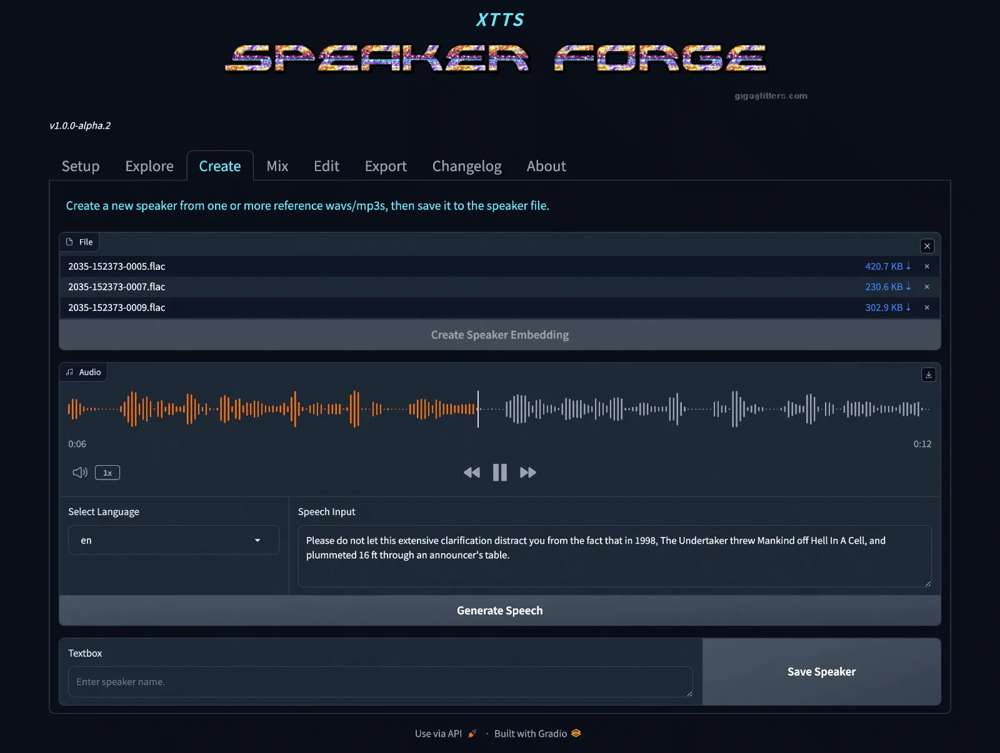
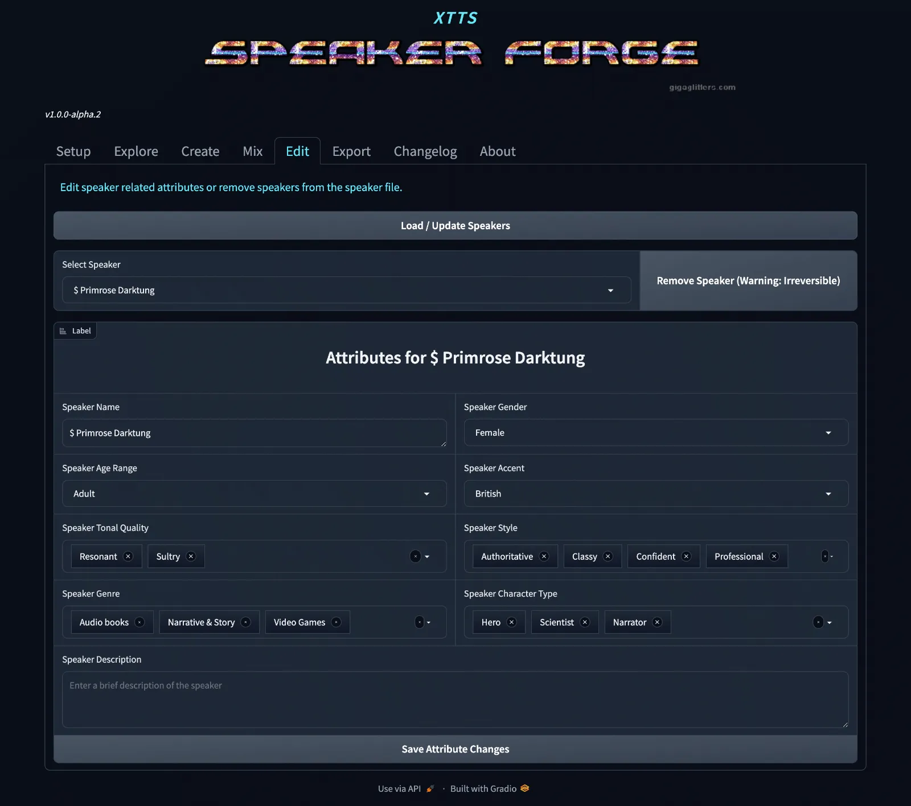
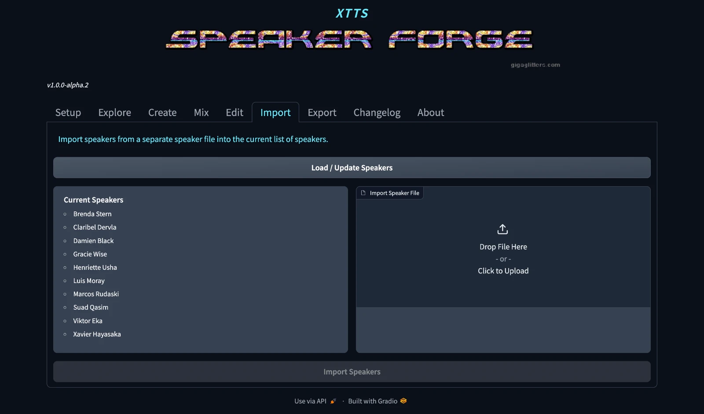
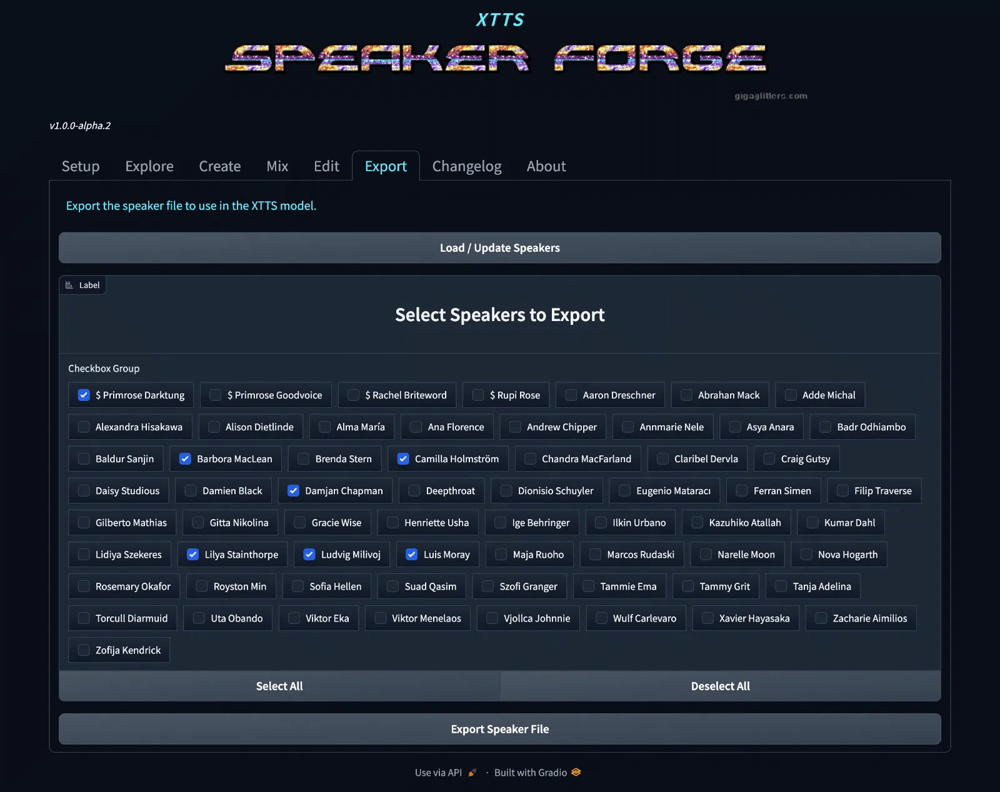

# XTTS Speaker Forge

_A Gradio interface for Exploring, Creating, Editing, Mixing, Importing and Exporting Speakers for the Coqui XTTS model._



## Run using Google Colab

- [Google Colab Notebook](https://colab.research.google.com/drive/17iobUgQNe08-B1w7UlcbwmukJiaow-K9)

## Run locally

1. Clone the repo `git clone https://github.com/ichabodcole/xtts-speaker-forge.git`
2. CD into the newly created directory `cd xtts-speaker-forge`
3. Create virtual python environment via venv, conda, etc (optional, but highly recommended)
4. Install the packages `pip install -q -r ./requirements.txt`
5. Run the app `bash run.sh`
6. Click open the gradio app at localhost:5003

## Package install Errors

If you encounter package install errors during step #4 of "Run locally" try the alternative installation below (you only need to try this if the app will not actually run).

```
!pip install --use-deprecated=legacy-resolver -q -r ./requirements.txt
!pip install -q typing_extensions==4.8 numpy==1.26.2
```

## Screenshots

<ul style="list-style: none; padding-left: 0;">
<li></li>
<li></li>
<li></li>
<li></li>
<li></li>
<li></li>
<li></li>
</ul>

## Roadmap

- [x] Add language selection support for speaker audio generation
- [x] Add "Edit" mode to allow renaming and deleting speakers, and adding additional speaker meta data.
- [ ] Audio file caching to quickly playback recently generated audio files.
- [ ] Allow editing model file paths in Gradio interface (if feasible)
- [x] Allow direct upload / import of speaker files
- [ ] Explore adding different voice mixing methods.
- [ ] Ability to filter speakers based on metadata created in Edit view in Explore view.
